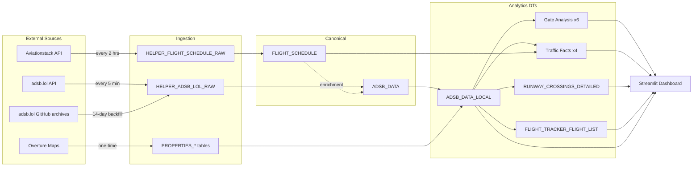
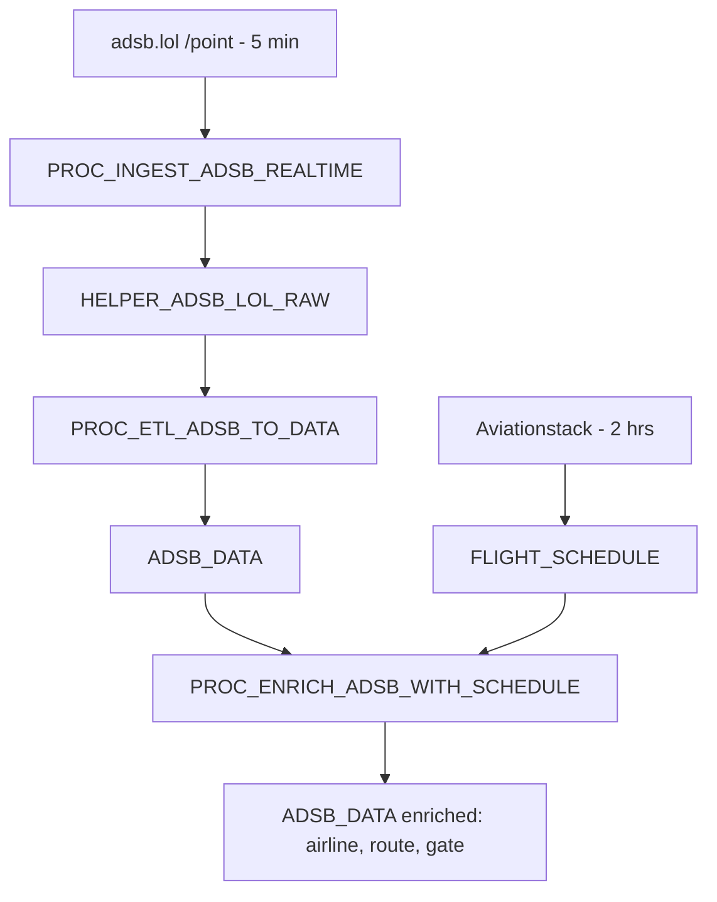
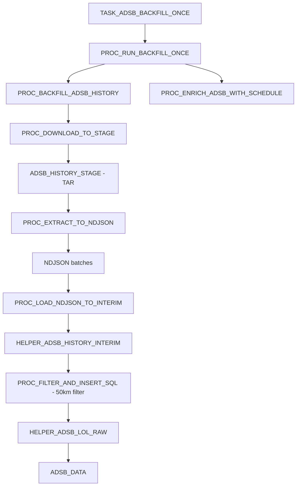
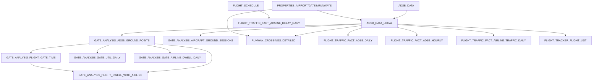

# Aviation Operations Intelligence Environment

**Solution:** Aviation Operations Intelligence (Snowflake-Labs `sfguide-aviation-ops-intelligence`)
**Airports deployed:** London Heathrow (`LHR` / `EGLL`) and London Gatwick (`LGW` / `EGKK`)

> This is a reference inventory of the pre-provisioned Snowflake environment the lab runs against. Object names and row counts are indicative.

---

## 1. Overview

This environment ingests, enriches, and analyses real-time and historical flight activity for two London airports. It combines two external data sources, transforms them through a cascade of Dynamic Tables, and surfaces the results in a multi-airport Streamlit dashboard.

Each airport has its own isolated database (`AIRPORT_LHR`, `AIRPORT_LGW`) and dedicated warehouse, sharing common account-level access integrations.

### Data sources

| Source | What | Frequency | Access |
|--------|------|-----------|--------|
| **adsb.lol** | ADS-B aircraft position & transponder telemetry (within 27 nm / ~50 km) | Live: every **5 min**. History: **14-day** per-second backfill | Free API, no key |
| **Aviationstack** | Flight schedules (departures + arrivals, all airlines) | Every **2 hours** (12×/day) | Free-tier API key (separate key per airport) |
| **Overture Maps** (`OVERTURE_MAPS__BASE`) | Airport geometry, runways, gates, infrastructure | One-time at install | Free Snowflake Marketplace listing |

---

## 2. Account-Level Objects (shared)

| Object | Type | Purpose |
|--------|------|---------|
| `OVERTURE_MAPS__BASE` | Database (Marketplace) | Source of airport/runway/gate/infrastructure geometry |
| `GITHUB_API_INTEGRATION` | API Integration | Allows Git repository stage to clone the solution repo |
| `AVIA_LHR_WH` | Warehouse (XSMALL, auto-suspend 60s) | Compute for LHR ingestion, tasks, dashboard |
| `AVIA_LGW_WH` | Warehouse (XSMALL, auto-suspend 60s) | Compute for LGW ingestion, tasks, dashboard |
| `AIRPORT_LHR_PUBLIC_ADSB_LOL_EAI` | External Access Integration | Egress to `api.adsb.lol:443` (LHR) |
| `AIRPORT_LHR_PUBLIC_GITHUB_EAI` | External Access Integration | Egress to GitHub (LHR backfill archives) |
| `AIRPORT_LHR_PUBLIC_AVIATIONSTACK_EAI` | External Access Integration | Egress to `api.aviationstack.com:80` (LHR) |
| `AIRPORT_LGW_PUBLIC_ADSB_LOL_EAI` | External Access Integration | Egress to `api.adsb.lol:443` (LGW) |
| `AIRPORT_LGW_PUBLIC_GITHUB_EAI` | External Access Integration | Egress to GitHub (LGW backfill archives) |
| `AIRPORT_LGW_PUBLIC_AVIATIONSTACK_EAI` | External Access Integration | Egress to `api.aviationstack.com:80` (LGW) |

Every object created by the solution carries a JSON `COMMENT` tag with `origin = sf_sit-is-aviation` for cost attribution and cleanup discovery.

---

## 3. Per-Airport Database Structure

Both `AIRPORT_LHR` and `AIRPORT_LGW` share an identical object layout in the `PUBLIC` schema (plus a `TAGS` schema for cost tags). Row counts below are current as of generation.

### 3.1 Schemas
- `PUBLIC` — all operational tables, views, dynamic tables, procedures, tasks
- `TAGS` — `SOLUTION` and `COMPONENT` cost-attribution tags

### 3.2 Reference / property tables (from Overture Maps)

| Table | LHR rows | LGW rows | Description |
|-------|---------:|---------:|-------------|
| `PROPERTIES_AIRPORT` | 1 | 1 | Airport metadata: name, IATA/ICAO, geometry, centroid, bounding box, timezone |
| `PROPERTIES_INFRASTRUCTURE` | 1,276 | 886 | All airport infrastructure objects (taxiways, aprons, terminals, runways, gates) within footprint |
| `PROPERTIES_GATES` | 148 | 73 | Gate reference points & geometry |
| `PROPERTIES_RUNWAYS` | 2 | 2 | Buffered runway polygons (used for crossing detection) |
| `HELPER_AIRLINE_DIM` | 1,222 | 1,222 | Airline IATA/ICAO → name lookup (seed CSV) |
| `HELPER_AIRLINE_IATA_ICAO_MAP` | 847 | — | IATA↔ICAO crosswalk derived from airline dim |

### 3.3 Raw ingestion tables (Bronze)

| Table | LHR rows | Description |
|-------|---------:|-------------|
| `HELPER_ADSB_LOL_RAW` | 12.35M | Raw ADS-B positions from live feed + backfill (one row per position sample) |
| `HELPER_FLIGHT_SCHEDULE_RAW` | 8,990 | Raw JSON flight records from Aviationstack (one row per API row) |
| `HELPER_ADSB_HISTORY_INTERIM` | 0 (transient) | Interim landing table for backfill NDJSON before filtering |

### 3.4 Canonical tables (Silver / Gold)

| Table | LHR rows | LGW rows | Description |
|-------|---------:|---------:|-------------|
| `ADSB_DATA` | 12.35M | 10.58M | Canonical ADS-B positions (deduped, enriched with airline/route/match fields) |
| `FLIGHT_SCHEDULE` | 3,260 | 1,485 | Canonical flight schedule (deduped by flight + scheduled times) |

### 3.5 Flight-matching helper tables

| Table | Description |
|-------|-------------|
| `HELPER_FLIGHT_LEG` | Airborne flight legs derived from ADS-B tracks (entry/exit, direction) |
| `HELPER_FLIGHT_MATCH_CANDIDATES` | Candidate schedule matches per leg, scored |
| `HELPER_FLIGHT_MATCH_RESULT` | Best schedule match chosen per leg |
| `HELPER_RECURRING_CALLSIGN_PRIOR` | Recurring callsign → airline/route prior (fallback enrichment) |
| `HELPER_AIRCRAFT_META` | Aircraft type/description lookup (GitHub enrichment) |

### 3.6 Historical backfill objects

| Object | Type | Description |
|--------|------|-------------|
| `ADSB_HISTORY_STAGE` | Internal stage | Holds downloaded TAR archives + extracted NDJSON during backfill |
| `HELPER_ADSB_BACKFILL_STATUS` | Table (14 rows) | Per-day backfill status tracking (downloaded/extracted/loaded/processed) |

**Backfill result:** 12 of 14 days processed per airport (17–28 May 2026). 2 most-recent days (29–30 May) were `not_available_yet` (adsb.lol had not yet published those archives). Inserted ~12.3M (LHR) / ~10.6M (LGW) per-second points.

### 3.7 Dynamic Tables (analytics cascade — 13 per airport)

All refresh on a **5-minute** target lag (matched to ingestion); the three foundation tables use `TARGET_LAG = DOWNSTREAM`.

| Dynamic Table | LHR rows | Description |
|---------------|---------:|-------------|
| `ADSB_DATA_LOCAL` | 5.61M | Foundation: ADS-B filtered to airport-relevant flights + `VEHICLE_CATEGORY` |
| `GATE_ANALYSIS_AIRCRAFT_GROUND_SESSIONS` | 21,026 | Continuous on-ground periods per aircraft |
| `GATE_ANALYSIS_ADSB_GROUND_POINTS` | 1.49M | Ground-phase points with nearest-gate join |
| `GATE_ANALYSIS_FLIGHT_GATE_TIME` | 15,714 | Gate assignment per ground session (max dwell) |
| `GATE_ANALYSIS_GATE_UTIL_DAILY` | 3,675 | Daily gate utilisation metrics |
| `GATE_ANALYSIS_GATE_AIRLINE_DWELL_DAILY` | 12,027 | Dwell per gate per airline per day |
| `GATE_ANALYSIS_FLIGHT_DWELL_WITH_AIRLINE` | 15,714 | Per-flight gate dwell enriched with airline |
| `RUNWAY_CROSSINGS_DETAILED` | 358 (LGW: 2,510) | Aircraft crossing runway polygons during taxi |
| `FLIGHT_TRAFFIC_FACT_ADSB_DAILY` | 133 | Daily traffic counts by vehicle category |
| `FLIGHT_TRAFFIC_FACT_ADSB_HOURLY` | 1,981 | Hourly traffic volumes |
| `FLIGHT_TRAFFIC_FACT_AIRLINE_TRAFFIC_DAILY` | 1,914 | Per-airline daily traffic |
| `FLIGHT_TRAFFIC_FACT_AIRLINE_DELAY_DAILY` | 77 | Per-airline delay metrics (schedule vs actual) |
| `FLIGHT_TRACKER_FLIGHT_LIST` | 16,526 | Deduplicated flight list for tracker dropdown |

### 3.8 Views

| View | Description |
|------|-------------|
| `V_AIR_OPS_DAILY_KPIS` | Daily operational KPIs (placeholder/extensible) |
| `V_AIR_OPS_TIMELINE` | Ops timeline (placeholder/extensible) |
| `HELPER_LANDING_LIVE_TIMETABLE`* | Live timetable joining latest ADS-B positions to schedules |

\* present where created by the views reference.

### 3.9 Monitoring & audit tables

| Table | Description |
|-------|-------------|
| `HELPER_INSTALL_AUDIT` | Installation metadata (version, IATA, warehouse, timestamps) |
| `HELPER_MONITOR_LAST_REFRESH` | DT refresh timestamps + `CONFIG_ADSB_BACKFILL_DAYS = 14` |
| `HELPER_QA_COUNTS_DAILY` | Daily row-count QA checks |
| `HELPER_INGEST_AUDIT` | Per-run ingest audit log |

---

## 4. Stored Procedures (19 per airport)

### Real-time ingestion
- `PROC_INGEST_ADSB_REALTIME()` — fetch live positions from adsb.lol → `HELPER_ADSB_LOL_RAW`
- `PROC_ETL_ADSB_TO_DATA()` — Bronze → Gold (`ADSB_DATA`), MERGE dedupe
- `PROC_DEDUP_ADSB_DATA(days)` — remove duplicate positions
- `PROC_ADSB_INGEST_AND_ETL()` — orchestrates ingest + ETL + dedupe (task entry point)

### Flight schedules
- `PROC_INGEST_FLIGHT_SCHEDULE(airport, date)` — call Aviationstack (dep + arr) → raw table
- `PROC_ETL_SCHEDULE_TO_FLIGHT_SCHEDULE()` — raw → canonical `FLIGHT_SCHEDULE`
- `PROC_FLIGHT_SCHEDULE_INGEST_AND_ETL()` — orchestrates ingest + ETL (task entry point)

### Enrichment
- `PROC_ENRICH_ADSB_WITH_SCHEDULE(days)` — match ADS-B tracks to schedules (callsign/registration/time)

### Historical backfill
- `PROC_DOWNLOAD_TO_STAGE(date)` — download globe_history TAR archives from GitHub
- `PROC_EXTRACT_TO_NDJSON(date)` — stream-extract traces → NDJSON batches
- `PROC_LOAD_NDJSON_TO_INTERIM(date)` — COPY NDJSON → interim table
- `PROC_FILTER_AND_INSERT_SQL(date)` — spatial filter (50 km) → `HELPER_ADSB_LOL_RAW` → ETL
- `PROC_PROCESS_FROM_STAGE(date)` — orchestrate extract→load→filter for one day
- `PROC_BACKFILL_ADSB_HISTORY()` — loop over 14 days (download then process)
- `PROC_RUN_BACKFILL_ONCE()` — task wrapper; runs backfill + enrich then self-suspends
- `PROC_START_BACKFILL_HISTORY()` — creates & resumes the one-shot backfill task
- `PROC_CLEANUP_STAGE(date)` — remove processed files from stage

### Utility
- `PROC_RESUME_OPTIONAL_TASK(name)` — safely resume a task
- `PROC_DEBUG_AVIATIONSTACK()` — diagnostic for the Aviationstack API (LHR only)

---

## 5. Tasks & Schedules

| Task | Schedule | Action |
|------|----------|--------|
| `TASK_INGEST_ADSB` | **Every 5 min** (`CRON */5 * * * *`) | `PROC_ADSB_INGEST_AND_ETL()` |
| `TASK_ENRICH_ADSB` | After `TASK_INGEST_ADSB` | `PROC_ENRICH_ADSB_WITH_SCHEDULE(2)` |
| `TASK_FLIGHT_SCHEDULE` | **Every 2 hours** (`CRON 0 */2 * * *`) | `PROC_FLIGHT_SCHEDULE_INGEST_AND_ETL()` |
| `TASK_ADSB_BACKFILL_ONCE` | One-shot (self-suspends) | `PROC_RUN_BACKFILL_ONCE()` — *suspended after completion* |

> Note: TSA throughput ingestion (part of the original US guide) was intentionally **skipped** — not applicable to UK airports.

---

## 6. Dashboard

| Object | Detail |
|--------|--------|
| `AIRPORT_LHR.PUBLIC.AIRPORT_ANALYTICS_DASHBOARD` | Streamlit-in-Snowflake app (auto-discovers both airports) |
| `AIRPORT_LHR.PUBLIC.DASHBOARD_STAGE` | SSE-encrypted internal stage hosting the app source |

Deployment notes: `environment.yml` pins `python=3.11.*` and `streamlit=1.42.*` (required for `st.pydeck_chart` `height`/`key` args); the stage uses `ENCRYPTION = (TYPE = 'SNOWFLAKE_SSE')`. The TSA page was removed.

Pages: Live View, Flight Tracker, Ground Activity, Runway Crossings, Traffic Analysis, Gate Analysis, Monitoring, Performance.

---

## 7. Lineage Diagrams

### 7.1 End-to-end data flow

### 7.2 ADS-B ingestion & enrichment pipeline

### 7.3 Backfill pipeline (one-shot, 14 days)

### 7.4 Dynamic Table dependency cascade

---

## 8. Data Point Reference

### ADS-B (`ADSB_DATA`)
ICAO hex, registration, aircraft type & description, callsign/flight, timestamp, GPS location (geography), track, true heading, velocity (ground speed), barometric altitude, geometric altitude, vertical rate, squawk, transponder category, source, plus enrichment columns: schedule flight key/number, airline name/IATA/ICAO, origin/destination airport, is-local-OD flag, scheduled departure/arrival, match method, match confidence.

### Flight schedules (`FLIGHT_SCHEDULE`)
Flight key, flight date, status, departure/arrival airports, scheduled/estimated/actual times (both ends), departure & arrival delays, terminal, gate, airline name/IATA/ICAO, flight number/IATA/ICAO, aircraft registration, codeshare flag, updated-at.

---

## 9. Current Data Volumes (snapshot)

| Metric | LHR | LGW |
|--------|----:|----:|
| ADS-B raw positions (`ADSB_DATA`) | 12,345,000 | 10,579,679 |
| ADS-B airport-local (`ADSB_DATA_LOCAL`) | 5,606,212 | 4,127,618 |
| Flight schedules | 3,260 | 1,485 |
| Runway crossings detected | 358 | 2,510 |
| Gates | 148 | 73 |
| Runways | 2 | 2 |
| History coverage | 17–28 May 2026 (12 days) | 17–28 May 2026 (12 days) |

---

## 10. Cleanup Reference

All objects are tagged with JSON `COMMENT` containing `"origin":"sf_sit-is-aviation"`. To tear down: drop databases `AIRPORT_LHR` and `AIRPORT_LGW`, warehouses `AVIA_LHR_WH` / `AVIA_LGW_WH`, the six External Access Integrations, `GITHUB_API_INTEGRATION`, and (optionally) `OVERTURE_MAPS__BASE`.
